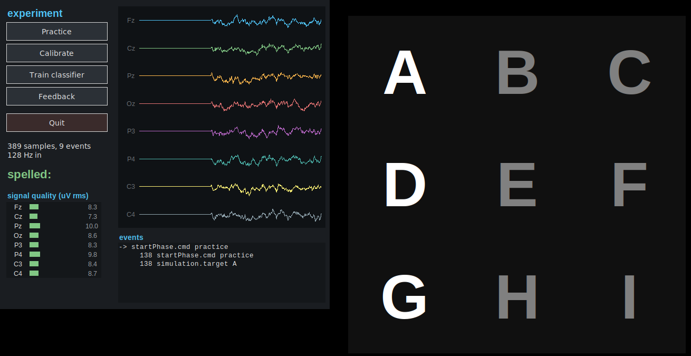

# pyspeller — buffer_bci as a pure-python framework

A minimal but complete BCI framework written entirely in python, with a working
P300 matrix speller on top of it: a 6x6 alphabet grid, the same kind of
spelling environment a commercial g.tec speller gives you.  It follows the same client–server
architecture as the rest of buffer_bci — a central buffer that stores data and
events, with independent clients around it — but every part of it, including
the buffer server itself, is python:

```
   g.tec amplifier ──LSL──▶ lsl_bridge.py ─┐
                                           ├─▶  buffer server  ◀─── control panel (gui)
   simulated amplifier ────────────────────┘     (data+events)        │      ▲
                                                   ▲       ▲          │      │
                                    stimulus ──────┘       └───── signal processing
                                    (speller display)              (epochs → classifier)
```

Nothing but `numpy` is required.  `pylsl` is needed only to talk to a real
amplifier, and `tkinter` only for the graphical interface.



**New to this?** [`docs/MANUAL.md`](docs/MANUAL.md) is a step-by-step manual for
running a session with a participant and a g.tec amplifier.

## Quick start

```bash
pip install numpy                       # the only hard dependency

# the whole thing in one process: buffer, simulated EEG, speller, gui
python -m pyspeller run

# or without any display: calibrate, train and spell, printing the results
python -m pyspeller demo --speed 10
```

`run` opens the control panel and the speller window.  Press **Calibrate** to
record a labelled block, **Train classifier** to fit the ERP classifier, then
**Feedback** to spell with it.  Every letter the classifier decides appears in
the speller's text field at the top of the grid, and in the panel's `typed:`
line, so the user sees the text grow as they spell it.  The panel also shows
the live signal, per-channel signal quality and the event stream.

### The speller matrix

The default grid is the 6x6 matrix of Farwell & Donchin that g.tec's speller
also uses, with the whole alphabet — plus the editing keys a user needs to fix
a letter the classifier got wrong:

```
A B C D E F      --layout 6x6-control  the default: A-Z, 0-5, . , _ and DEL
G H I J K L      --layout 6x6          the classic grid: A-Z, 1-9 and _
M N O P Q R      --layout 3x3          a small grid for quick demos
S T U V W X
Y Z 0 1 2 3
4 5 . , _ DEL
```

Twelve groups (six rows, six columns) are flashed per repetition, so one letter
at the default twelve repetitions takes about 22 seconds — the same order as a
commercial system.

**Copy spelling** (Calibrate / Feedback) cues a letter and scores the result;
**Free spelling** just flashes and types whatever the classifier decides, which
is how a user actually works.  Press **Free spelling** on the panel or send
`startPhase.cmd = free`.

### Correcting a letter

`_` types a space, `DEL` rubs out the last character and `CLR` clears the line.
`DEL` is a cell like any other, so the user corrects a wrong letter by
selecting it with the same P300 response they spell with — no help needed.

The same correction can also come from outside, for when the user would rather
not spend a selection on it: the control panel has **⌫ backspace** and
**clear** buttons, and any client can send the event

    speller.edit = DEL      (or CLR)

Corrections are applied when that event comes back from the buffer, so the
speller window, the control panel and anything else watching end up with the
same text.

A typical run of `demo` prints something like:

```
calibrating on B R A I N ...
[sigproc] gathered 720 epochs (120 target, 600 non-target)
[sigproc] classifier trained: cross-validated AUC 0.773, accuracy 0.72
spelling B C I ...
typed: 'BCI'  (cued: 'BCI')
letter accuracy: 3/3
```

## Running the components separately

In a real experiment each client runs in its own process, often on different
machines (pass `--host`):

```bash
python -m pyspeller buffer                 # 1. the data and event server
python -m pyspeller simulator              # 2. an amplifier ... (or see below)
python -m pyspeller sigproc --model clsfr.pkl   # 3. online signal processing
python -m pyspeller speller                # 4. the stimulus display
python -m pyspeller gui                    # 5. control panel + live signals
python -m pyspeller save                   # 6. record everything to disk
```

The control panel publishes `startPhase.cmd` events; the speller and the signal
processing client obey them.  Any other client can do the same, which is how
the tests drive an experiment without a display.

## Using a g.tec amplifier over Lab Streaming Layer

g.tec devices (g.USBamp, g.HIamp, g.Nautilus) are published as an LSL stream by
g.NEEDaccess or the gtec LSL connector.  Start that on the amplifier machine,
then:

```bash
pip install pylsl                      # ships liblsl
python -m pyspeller lsl --list         # what is on the network?
# g.USBamp-UB-2016.03.06   type=EEG   channels=16  rate=256 Hz  host=lab-pc

python -m pyspeller lsl --name g.USBamp-UB-2016.03.06
# or take the only EEG stream on the network:
python -m pyspeller lsl --type EEG
```

The bridge copies samples into the buffer and writes the stream's channel
labels into the buffer header, so the rest of the framework sees the real
montage.  If a marker stream is present it is forwarded as `lsl.marker`
events, timestamp-aligned to the sample index.  To run everything against the
amplifier in one process:

```bash
python -m pyspeller run --lsl --lsl-type EEG
```

Points worth checking with real hardware: the LSL stream must have a nominal
sample rate (the buffer is a regularly sampled store), and the speller's
`--isi` should be a multiple of the amplifier's block size if the device sends
large blocks, otherwise flash timing is quantised to the block.

## Saving the data

Recording is a client like any other, so it works with the simulator and with
a real amplifier:

```bash
python -m pyspeller save --subject S01 --experiment speller
# saving 8 channels at 256 Hz to ~/output/speller/S01/260921/1503/raw_buffer

python -m pyspeller run --save            # record the session the gui runs
python -m pyspeller demo --save           # ... or the headless demo
python -m pyspeller sigproc --save-dir ~/output/S01   # epochs + classifier
```

The files follow the FieldTrip offline-buffer layout that buffer_bci already
reads, in a `<root>/<experiment>/<subject>/<date>/<time>/raw_buffer/`
directory, as `getBufferSaveDir.py` lays it out:

| file | contents |
| --- | --- |
| `header` | binary header: channels, sample rate, sample type, channel labels |
| `header.txt` | the same in ascii (`fSample=256`, `nChans=8`, `1:Fz`, ...) |
| `samples` | the raw samples, channels fastest, in the header's data type |
| `events` | every event in the buffer's own wire format |
| `calibration_epochs.npz` | the cut, labelled calibration epochs (`--save-dir`) |
| `classifier.pkl` | the trained ERP classifier (`--save-dir`) |

So a recording can be read with `matlab/offline/read_buffer_offline_data.m`,
replayed into a buffer with `matlab/dataAcq/buffer_fileproxy.m`, or loaded in
python:

```python
from pyspeller.acquisition.saver import load_session, load_epochs

header, samples, events = load_session('~/output/speller/S01/260921/1503/raw_buffer')
samples.shape           # (59525, 8) -- samples x channels, microvolts
[e for e in events if e.type == 'classifier.prediction']

epochs, labels, meta = load_epochs('.../calibration_epochs.npz')
epochs.shape            # (720, 8, 77) -- epochs x channels x samples
```

If the buffer's ring wraps before the saver gets to it (a stalled disk, a
paused process), the missing samples are written as zeros and recorded in
`saver.gaps`, so that the sample indices stored in the events keep pointing at
the right place in the file.

## What the pipeline does

| stage | where | what |
| --- | --- | --- |
| stimulus | `speller/stimulus.py` | flashes each row and column `n_repetitions` times in random order, never repeating a group within `min_gap` flashes |
| events | buffer | `stimulus.rowFlash` / `stimulus.colFlash` carry the flashed index; during calibration `stimulus.tgtFlash` carries the 1/0 label |
| corrections | buffer | `speller.edit` = `DEL` / `CLR` edits the typed text from any client |
| epoching | `signalproc/epochs.py` | cuts the 600 ms after each flash once those samples have arrived |
| pre-processing | `signalproc/preproc.py` | linear detrend, common average reference, trapezoidal 0.5–10 Hz FFT band-pass, boxcar downsample to 16 Hz, outlier channel/epoch rejection |
| classification | `signalproc/classifier.py` | shrinkage LDA over channels × time, reported with stratified 5-fold cross-validated AUC |
| decoding | `speller/matrix.py` | classifier output is averaged per row and per column; the best row and best column intersect at the predicted letter |
| feedback | buffer | `classifier.prediction` carries the letter; the speller shows it in the grid and appends it to the text field |

Everything is configured from one place, `pyspeller/config.py` (the
counterpart of `configureSpeller.m`): grid layout, timing, filter band,
repetitions, channel montage.

## The simulated subject

`acquisition/simulator.py` is what makes the whole thing runnable without
hardware.  It generates 1/f background EEG with an alpha rhythm, a common-mode
component shared by all electrodes and occasional eye blinks, and it watches
the buffer for flash events: when a flashed group contains the attended symbol
(announced by the stimulus client as `simulation.target`) it adds a P3b —
centro-parietal, peaking near 320 ms, with trial-to-trial amplitude and latency
jitter.  Every flash also evokes a small visual response, so the classifier has
to find the target/non-target difference rather than "flash versus nothing".

`--erp-amplitude` and `--noise-amplitude` set the difficulty in microvolts; the
defaults (8 µV P300, 10 µV background) give single-flash AUCs around 0.75–0.8,
which is what a decent real P300 session looks like.

## Running an experiment faster than real time

Timing comes from a clock object rather than `time.sleep`, and `--speed N`
compresses experiment time by N.  Because the data are indexed by samples, a
run at `--speed 20` produces the same epochs as a real-time run, which is how
the end-to-end test spells six letters in five seconds.  During an accelerated
run the stimulus paces itself on the buffer's sample counter
(`clock.BufferClock`) so that two flashes can never land on the same sample.

## Tests

```bash
python -m unittest discover -s tests           # 62 tests, about 30 s
xvfb-run python -m unittest tests.test_gui     # the tk parts, headless
```

They cover the wire protocol, the server (including ring-buffer wrap-around and
blocking waits), pre-processing, the classifier, epoching, the simulator's ERP,
saving and loading a session (including the padded-gap case), the speller
layouts and the typed-text rules, the LSL bridge (skipped without pylsl), the
tk widgets (skipped without a display), and a full calibrate → train → spell
experiment on the 6x6 alphabet grid that asserts the classifier beats chance
and that the speller types the cued word.

`tests/test_interop.py` drives this server with buffer_bci's own
`dataAcq/buffer/python/FieldTrip.py` client, so the pure-python buffer stays
usable from the matlab, java and C sides of the project.

## Layout

```
pyspeller/
  buffer/        protocol.py, server.py, client.py   the fieldtrip buffer, in python
  acquisition/   simulator.py, lsl_bridge.py, lsl_outlet.py, saver.py
  signalproc/    preproc.py, epochs.py, classifier.py
  speller/       matrix.py, stimulus.py, sigproc.py, render.py, text.py
  gui/           control_panel.py
  clock.py, config.py, experiment.py, cli.py
```

## Limitations

* Feedback is epoch-based: a letter is decided after a fixed number of
  repetitions, with no dynamic stopping and no language model — where a
  commercial speller would stop early once the evidence is clear, and would
  suggest the likely word.
* There is no error-potential detection: a wrong letter is corrected with the
  DEL key or the backspace button, not automatically.
* The saver writes one session per run; it does not split `samples` into
  numbered files the way the java saver does for very long recordings (the
  matlab reader supports that, this writer does not use it).
* The classifier is retrained from scratch per session; there is no online
  adaptation or cross-session transfer.
* The tk renderer is fine for a 3×3 or 6×6 grid at 150 ms ISI, but it is not a
  frame-locked stimulus engine — for sub-frame timing accuracy drive the
  hardware trigger of the amplifier instead.
